# Análise e Planejamento: Painel Administrativo SaaS Web & API REST

Este documento traz a análise do estado atual da arquitetura de licenciamento (SaaS) do Lazarus Portable Manager e propõe um planejamento de modernização profissional para criar um **Painel Administrativo Web** e uma **API REST segura**.

---

## 1. Análise do Estado Atual (Diagnóstico)

Atualmente, o licenciamento do Lazarus Portable Manager funciona da seguinte forma:
* **Banco de Dados**: Um banco Firebird (`LazarusBackup.fdb`) rodando em uma VPS Linux remota.
* **Comunicação**: O aplicativo cliente desktop conecta-se **diretamente** ao banco de dados via TCP/IP (porta 3050) usando o driver do Firebird.
* **Painel Administrativo**: Está embutido **dentro do próprio aplicativo cliente desktop**. Se o usuário logado tiver a flag `IS_ADMIN = 1`, a aba de pagamentos ganha botões para aprovar ou rejeitar comprovantes.

### Limitações e Vulnerabilidades Atuais:
> [!WARNING]
> 1. **Segurança de Banco de Dados**: A porta `3050` do Firebird precisa ficar exposta para toda a internet. Isso torna o servidor vulnerável a ataques de força bruta, escaneamento de portas e negação de serviço (DDoS).
> 2. **Exposição de Credenciais**: Embora o arquivo `vps_config.ini` esteja criptografado localmente, a chave de criptografia está embutida no binário da aplicação. Engenharia reversa no executável desktop permitiria extrair a senha master do banco, dando acesso total de leitura e escrita ao banco de dados do SaaS.
> 3. **Indisponibilidade Web**: O administrador só consegue gerenciar o sistema abrindo o aplicativo desktop. Não há um portal web para que clientes acompanhem o status ou enviem comprovantes sem baixar o app, ou para o admin gerenciar de um celular.

---

## 2. Nova Arquitetura Proposta (SaaS Profissional)

Para tornar o sistema robusto, escalável e seguro, propomos a transição para uma arquitetura SaaS moderna com **API REST** intermediadora:

```mermaid
graph TD
    Client[Executável Desktop] -- HTTPS / API REST --> API[API REST Backend - Python/FastAPI]
    WebAdmin[Painel Web Admin - React] -- HTTPS / API REST --> API
    API -- Conexão Local / localhost --> DB[(Banco Firebird - VPS)]
    
    style DB fill:#1e293b,stroke:#00adb5,stroke-width:2px;
    style API fill:#164e63,stroke:#0ea5e9,stroke-width:2px;
    style WebAdmin fill:#4c1d95,stroke:#8b5cf6,stroke-width:2px;
    style Client fill:#1e40af,stroke:#3b82f6,stroke-width:2px;
```

### Principais Benefícios:
1. **Segurança Máxima**: A porta `3050` do banco Firebird será fechada no Firewall da VPS para conexões externas. Apenas o servidor da API (rodando localmente em `localhost`) poderá se conectar ao banco.
2. **Ocultação de Credenciais**: O executável desktop nunca saberá o usuário e senha do banco de dados; ele apenas fará requisições HTTPS para endpoints da API (ex: `/api/v1/login`) usando tokens JWT temporários.
3. **Gerenciamento de Qualquer Lugar**: O painel administrativo será uma aplicação Web responsiva, acessível de computadores ou celulares via navegador.

---

## 3. Especificação Técnica do Planejamento

### A. Backend: API REST (Python / FastAPI)
* **Tecnologia**: Python com **FastAPI** (rápido, documentação OpenAPI automática, assíncrono).
* **Conexão com Banco**: Driver Python `fdb` para manipulação do Firebird.
* **Autenticação**: Tokens **JWT (JSON Web Tokens)** para sessões seguras.
* **Endpoints Principais**:
  * `/api/v1/auth/login` (Login de clientes e administradores)
  * `/api/v1/auth/register` (Cadastro de novos usuários)
  * `/api/v1/license/validate` (Validação de HWID e status da licença)
  * `/api/v1/payment/submit` (Envio de comprovante PIX em base64)
  * `/api/v1/admin/payments` (Listar, aprovar ou rejeitar comprovantes - restrito ao Admin)
  * `/api/v1/admin/users` (Gerenciar usuários e licenças - restrito ao Admin)

### B. Frontend: Painel Administrativo Web (React + Tailwind CSS)
* **Tecnologia**: React.js com Vite e Tailwind CSS para design responsivo premium.
* **Funcionalidades da Área Admin**:
  * **Dashboard**: Gráficos de novos cadastros, faturamento mensal, licenças ativas e comprovantes aguardando análise.
  * **Aprovação de PIX**: Visualizador de comprovantes (BLOBs de imagem/PDF) com aprovação/rejeição em um clique.
  * **Gestão de Usuários**: Busca de usuários, bloqueio de contas, edição de HWID e extensão manual de validade de licença.
  * **Configurações PIX**: Alteração da chave PIX receptora e valor da licença diretamente na web.

---

## 4. Plano de Ação Passo a Passo

### Fase 1: Desenvolvimento da API REST
1. Criar o esqueleto do projeto Python (`FastAPI`).
2. Configurar a biblioteca `fdb` para se conectar ao banco Firebird existente.
3. Desenvolver os endpoints de autenticação e validação de licença.
4. Desenvolver endpoints administrativos de gestão de usuários e pagamentos.

### Fase 2: Desenvolvimento do Painel Web (Front)
1. Iniciar o app React usando o kit de ferramentas do assistente.
2. Desenvolver a tela de login administrativo segura.
3. Criar a interface de aprovação de pagamentos com visualizador de imagens.
4. Criar a tabela de gestão de usuários com filtros de pesquisa e ações de controle de licença.

### Fase 3: Adaptação do Executável Lazarus (Desktop)
1. Modificar a unit `uLicenseManager.pas` no Lazarus para usar o componente `FPHttpClient` (ou `IdHTTP`) para se comunicar com a API via HTTPS, substituindo a conexão direta do `TIBConnection`.
2. Remover do executável desktop o carregamento direto do arquivo de configuração do banco `vps_config.ini`.

---

## 5. Perguntas Abertas para o Usuário

> [!IMPORTANT]
> 1. **Deseja que iniciemos o desenvolvimento da API e do Painel Web diretamente na VPS Linux ou criamos a estrutura localmente na sua máquina para teste antes do deploy?**
> 2. **Prefere que o painel web administrativo tenha também uma área de login para os clientes consultarem o status e gerarem o Pix Copia e Cola via web, ou mantemos apenas a área restrita do Administrador?**
