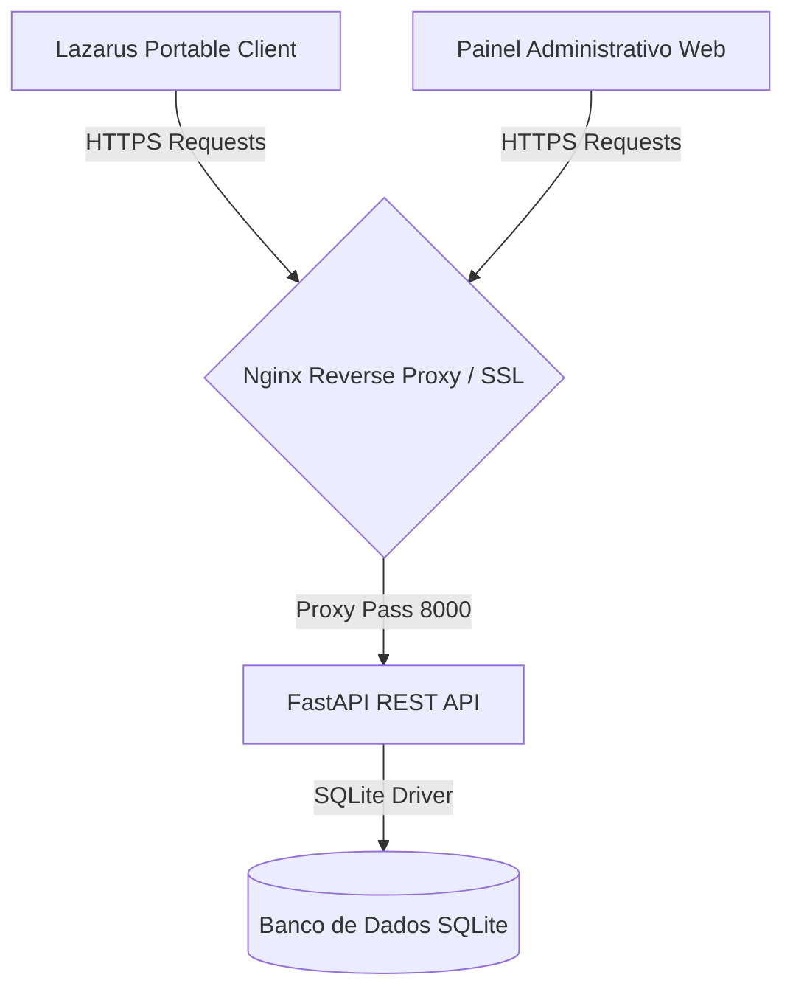

# Walkthrough - Implementação do Painel Administrativo SaaS Web e API REST

Realizamos a modernização completa do sistema de licenciamento (SaaS) do **Lazarus Portable Manager**, saindo de uma conexão direta ao banco de dados Firebird e adotando uma arquitetura moderna e segura com **API REST (FastAPI)**, **Painel Administrativo Web (Tailwind CSS)** e **Integração Cliente via HTTPS (fphttpclient)**.

---

## 1. Arquitetura do Sistema Modernizado

- **Cliente Desktop (Delphi/Lazarus)**: Consome a API REST usando a unit nativa `TFPHTTPClient` e sockets OpenSSL. Não há mais portas de banco de dados expostas na VPS, garantindo segurança máxima.
- **REST API Backend (Python + FastAPI)**: Executa no servidor VPS Linux, gerenciado pelo `pm2` (`lazarus-portable-api`) e exposto de forma segura via HTTPS na porta 443 através do Nginx.
- **Painel Administrativo (HTML/Tailwind/JS)**: Uma interface web moderna, rápida e responsiva que permite ao administrador gerenciar licenças, aprovar/rejeitar comprovantes de pagamento e atualizar chaves Pix em tempo real.
- **Banco de Dados (SQLite)**: Leve, robusto, com backup automático fácil e totalmente isolado na VPS.

---

## 2. API REST - Endpoints Implementados

Os endpoints estão disponíveis sob o domínio HTTPS seguro `https://connecttask.com.br/lazarus/api/api/v1`:

### Autenticação & Cadastro
- `POST /auth/register`: Cadastra um novo desenvolvedor com trial automático de 10 dias.
- `POST /auth/login`: Autentica o usuário e retorna o token de acesso (JWT).

### Licenciamento
- `POST /license/validate`: Valida a licença activa ou trial comparando o HWID da máquina.

### Pagamentos & Comprovantes
- `POST /payment/submit`: Upload de comprovante de Pix (Multipart Form Upload para PDFs ou imagens).
- `GET /payments`: Retorna os comprovantes (lista completa para o Admin; filtrada apenas por usuário para os clientes normais).

### Administrativo (Restritos a Admin via JWT)
- `POST /admin/payments/approve`: Aprova o pagamento e injeta os dias de licença especificados.
- `POST /admin/payments/reject`: Rejeita o comprovante e define um motivo legível para o usuário.
- `GET /admin/payments/{id}/image`: Visualização direta do arquivo de comprovante original.
- `POST /admin/config/pix`: Atualização dinâmica das chaves Pix e valor de assinatura exibidos no app.

---

## 3. Painel Administrativo Web (SaaS Dashboard)

O painel administrativo está hospedado de forma segura em:  
**URL:** [https://connecttask.com.br/lazarus/admin/](https://connecttask.com.br/lazarus/admin/)

### Funcionalidades do Dashboard:
1. **Filtros por Status**: Filtre instantaneamente entre comprovantes *Pendentes*, *Aprovados* ou *Rejeitados*.
2. **Visualizador de Imagem Integrado**: Modal moderno com zoom e rotação de 90° em 90° (essencial para ler comprovantes capturados de lado/celular).
3. **Gerenciador de Licenças**: Campo dinâmico para definir quantos dias deseja adicionar ao aprovar (ex: 30 dias para mensal, 365 para anual).
4. **Configurações Gerais**: Atualize chaves Pix (Telefone, CNPJ, E-mail, EVP), titular, banco parceiro, valor padrão da licença e notas/avisos.

---

## 4. Adaptação do Cliente Lazarus (Desktop)

A unit [uLicenseManager.pas](file:///c:/Fontes/Componentes/TLazarusBakcup/LazarusPortable/units/uLicenseManager.pas) foi totalmente reescrita para consumir a API REST:
- **Zero Dependências de Drivers**: Foram removidas todas as instâncias e conexões diretas `TIBConnection`, `TSQLTransaction` e `TSQLQuery` no fluxo de validação de licenças.
- **Portabilidade Total**: A unit `TFPHTTPClient` integrada ao Lazarus garante que o aplicativo faça requisições HTTPS e manipule o retorno JSON nativamente (`fpjson`, `jsonparser`), sem necessidade de qualquer arquivo ou DLL adicional no computador do cliente final.
- **Compatibilidade Retroativa**: As assinaturas das funções originais da unit foram 100% mantidas. Isso permitiu que a aplicação compilasse sem quebrar nenhum formulário antigo do sistema (`frmLogin`, `frmMain`, `frmPayment`, etc.).

---

## 5. Compilação e Entrega do Instalador

- Ambas as soluções (`LazarusPortable.lpi` e `LazPortableTools.lpk`) foram compiladas com sucesso no Lazarus com a nova unit de licenças integrada.
- O Inno Setup gerou o instalador final do Lazarus Portable Manager atualizado em:  
  [LazarusPortableSetup.exe](file:///c:/Fontes/Componentes/TLazarusBakcup/Output/LazarusPortableSetup.exe).
